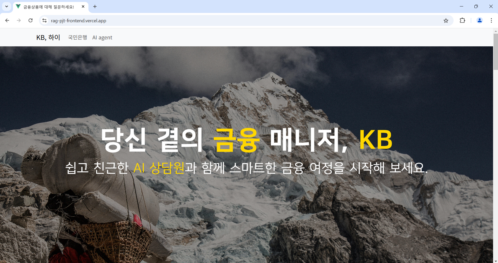
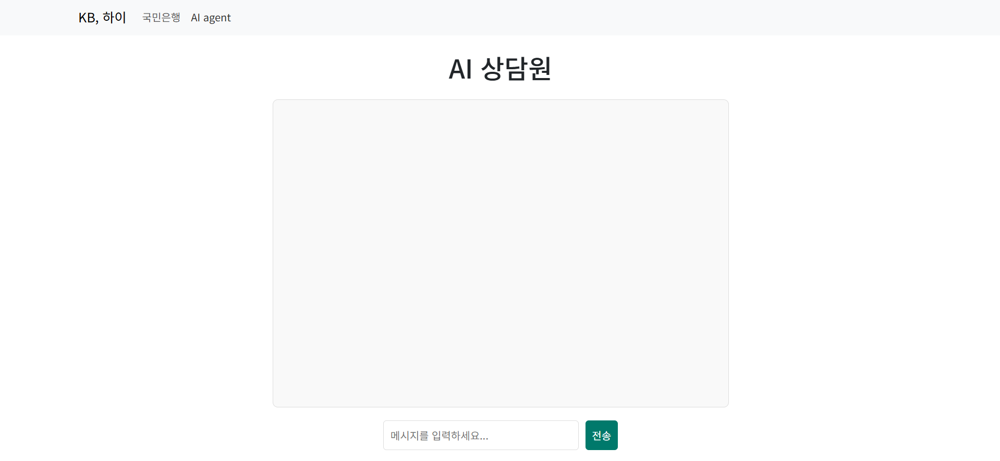

# RAG 기반 국민은행 AI 상담원
## 서비스 소개
### 백엔드
[API Github](https://github.com/BangSungjoon/RAG_pjt_backend)
- 국민은행 금융 상품(예금, 적금, 대출) 상품 설명서를 HTML로 변환 후 임베딩하여 vectorDB에 저장
- vectorDB를 기반으로 사용자의 질문에 맞는 정보를 찾아주고 요약해주는 서비스 API
- 사용자의 입력을 형태소 분석하여 알맞은 namespace의 정보를 가져오는 방식으로 정확도 향상
### 프론트
- API의 /chat 엔드포인트를 활용한 AI chatbot 서비스
- [vercel을 통한 배포](https://rag-pjt-frontend.vercel.app/)
- Vue + bootstrap
## 서비스 사진
### 홈페이지 (서비스 소개)


### AI 상담원 (chatBot)

## Project Setup

```sh
npm install
```

### Compile and Hot-Reload for Development

```sh
npm run dev
```

### Compile and Minify for Production

```sh
npm run build
```
